# Auto-formatting Java projects using Google Java Style Guide
[The Google Java Style Guide](https://google.github.io/styleguide/javaguide.html) is a well-structured and clean way of formatting your Java source files, making every file consistent and easy to read across projects. Abstracting the process of thought regarding code formatting away from a developer helps them to focus on what is important and can significantly reduce any arguments amongst teams that all have personal preferences for formatting styles.

This document gives a quick walk-through setting up plugins for using this coding style for multiple IDEs to hopefully enable harmony and allow developers to focus on the content of their code, rather than the structure.

The provided `format-demo` project within only serves as a "hello world" using Spring as a basis for demonstrating the setup.

## Maven Plugin
1. Include the `googleformatter-maven-plugin` in the `pom.xml`:
```xml
    <plugin>
      <groupId>com.theoryinpractise</groupId>
      <artifactId>googleformatter-maven-plugin</artifactId>
      <version>1.7.3</version>
      <executions>
        <execution>
          <id>reformat-sources</id>
          <configuration>
            <includeStale>false</includeStale>
            <style>GOOGLE</style>
            <formatMain>true</formatMain>
            <formatTest>true</formatTest>
            <filterModified>false</filterModified>
            <skip>false</skip>
            <fixImports>false</fixImports>
            <maxLineLength>100</maxLineLength>
          </configuration>
          <goals>
            <goal>format</goal>
          </goals>
          <phase>process-sources</phase>
        </execution>
      </executions>
    </plugin>
```
1. Run the `format` goal:
```
mvn googleformatter:format
```

### Running as a Git Hook
 You will need a local instance of maven installed and setup. Alternatively, you can use the maven-wrapper if present in the project, but this is not necessarily platform independent. If you are using Windows, this will only work if you have Git for Windows installed as your default Git command line tool. Powershell 7+ also seems to be compatible without issues.

1. In the root directory of the project, there is a hidden `.git` folder.
1. Navigate to `.git/hooks` and you will see sample hooks.
1. For running the plugin before any commit, rename `pre-commit.sample` to `pre-commit` (or create a new one) and add the shell command for running maven and include the shebang:
```sh
#!/bin/sh

mvn googleformatter:format
```
Now, anytime you run `git commit`, the plugin will run and format your code. If any changes are made, they are not automatically staged. You must restage them with `git add <file or path>` as you would usually, then re-commit the changes.

If you have multiple maven projects set up in the base git folder, or the maven project is not present at the base of the project, you can use other bash commands to navigate normally.

Example:
```
.git
project1/
    ---- some maven project
project2/
    ---- another maven project
README.md
```

You can use the following shell script to execute the formatter in both projects before commits:
```sh
#!/bin/sh

cd project1
mvn googleformatter:format
cd ../project2
mvn googleformatter:format
```

## VSCode
### Pre-Requesite
If not already installed, install the [Language Support for Java extension by RedHat](https://marketplace.visualstudio.com/items?itemName=redhat.java)

### Setup
1. Download the `google-java-format` jar [here](https://github.com/google/google-java-format/releases/download/v1.10.0/google-java-format-1.10.0-all-deps.jar)
1. Install the [Google Java Format plugin](https://marketplace.visualstudio.com/items?itemName=mngrm3a.vscode-google-java-formatter)
1.  Open settings.json
    1. `ctrl+shift+P` or right-click and select `Command Palette`
    1. Enter `settings.json` and select the option to open this
        !(settings.json)[media/settingsjson.png]
1. Add the following to the JSON:
```json
"gjf.jarPath": "C:\\<FULL_PATH_TO_GOOGLE_JAVA_FORMAT_PLUGIN>.jar"
```
As an example:
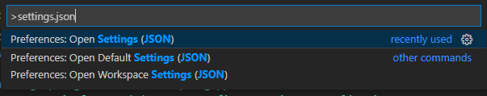

### Formatting
1. Right click the file to format and select `Format Document` or press `shift+alt+f` (default hotkey)
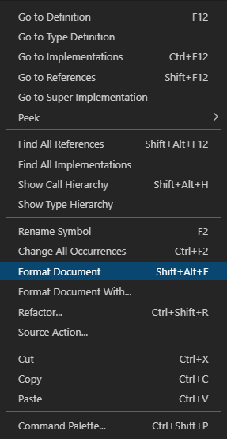

1. You will get a pop-up asking you to select a formatter. Select
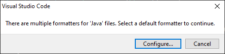
1. Select `Configure` and then select the `Google Java Format` from the command palette dropdown.
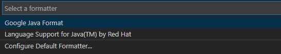

You'll now use the Google style for formatting.
Before:
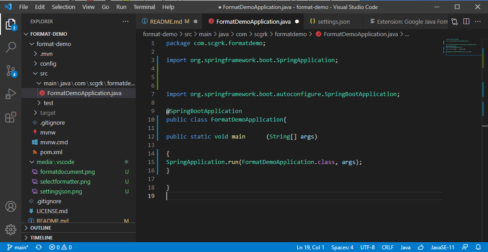
After:
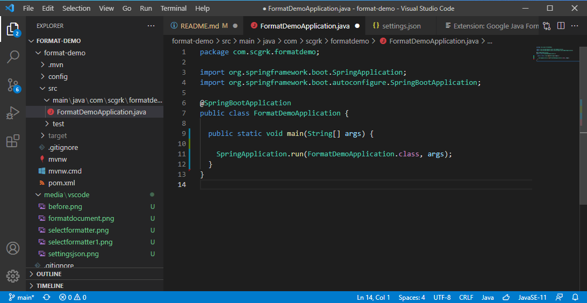

## Eclipse
### Setup
Directions from Google can be found [in the repository](https://github.com/google/google-java-format#eclipse) should these be unclear.
1. Download the [google-java-format Eclipse Plugin](https://github.com/google/google-java-format/releases/download/google-java-format-1.6/google-java-format-eclipse-plugin_1.6.0.jar)
1. Copy the jar file to the "Dropins" folder in Eclipse. This is located inside the install path.
For example:
  ```
  C:\Users\scgrk\eclipse\java-2021-03\eclipse\dropins
  ```
1. Restart Eclipse (if already running)
1. Open `Window -> Preferences -> Java -> Code Style -> Formatter`. A new `Formatter Implementation` dropdown is available here. Select `google-java-format`.
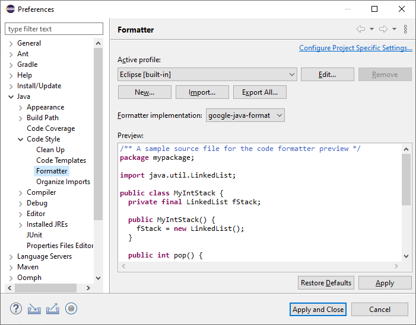
1. Select `Apply and Close`

### Formatting
1. Right click the file to format and select `Source -> Format` or use the hotkey `ctrl+shift+F`
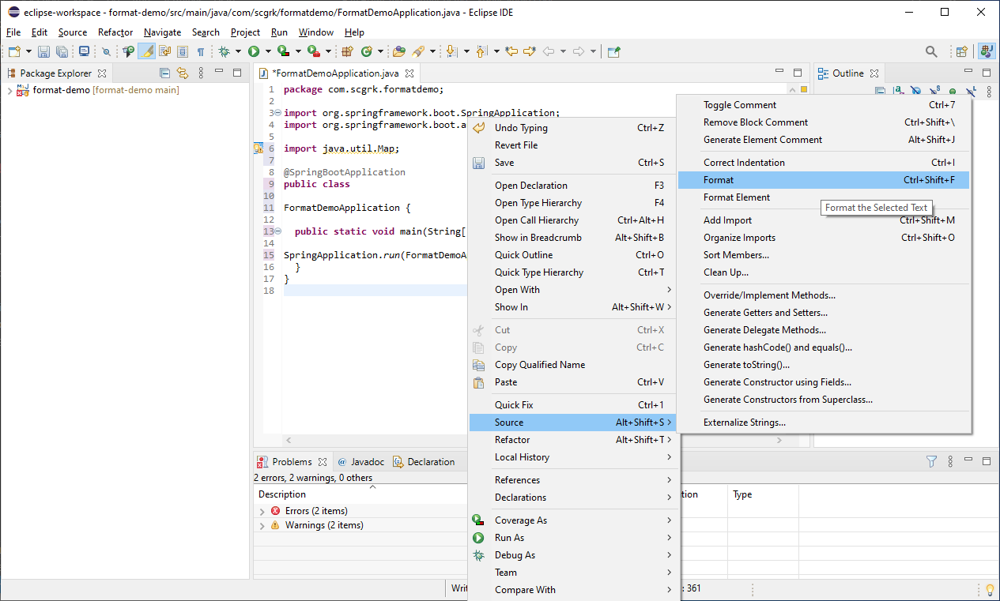
1. To enable auto-formatting on save, open `Window -> Preferences -> Java -> Editor -> Save Actions`. Check the "Perform the selected actions on save" option, and "Format source code" option. It is recommended you select for all lines, but this can be a significant change across legacy code. It is also recommended you select the "Organize imports" option as well to automatically remove any unused imports.
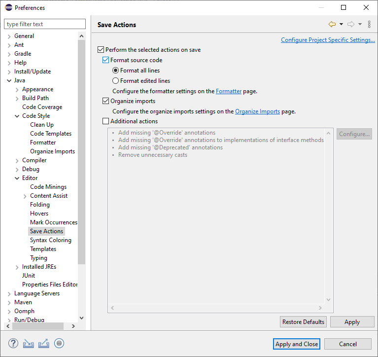

This will now format your files automatically.
Before:
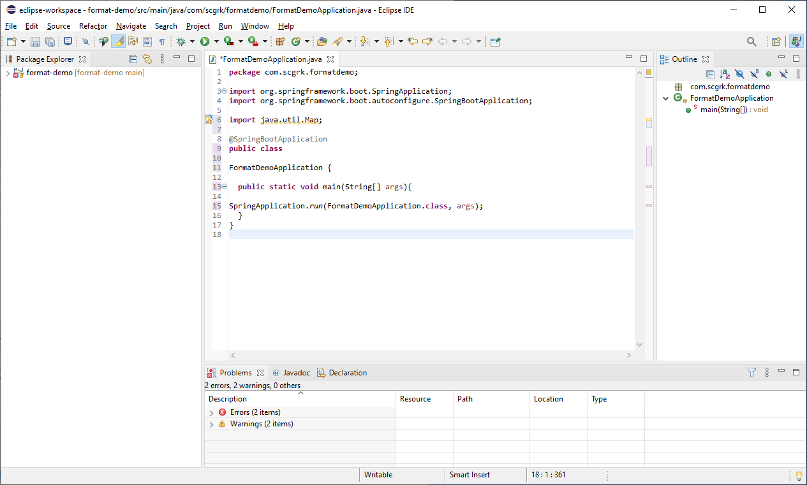
After:
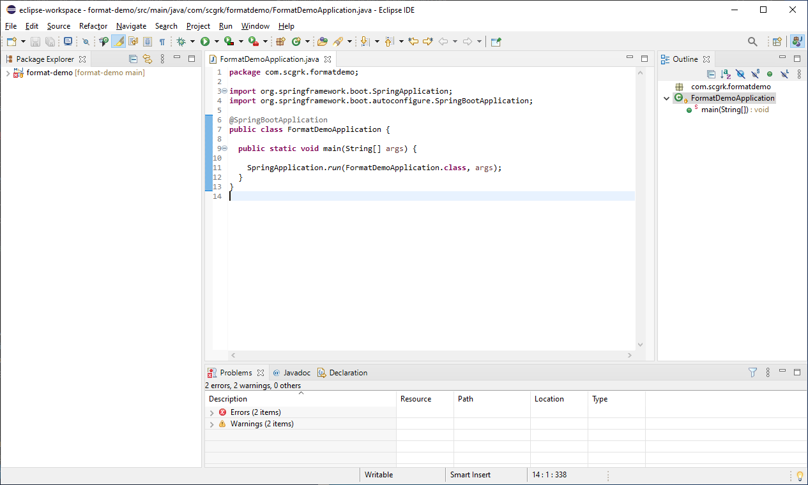

## IntelliJ
### Setup
1. Open the Plugin manager from `File -> Settings -> Plugins` and search for `google-java-format` and select `Install`.
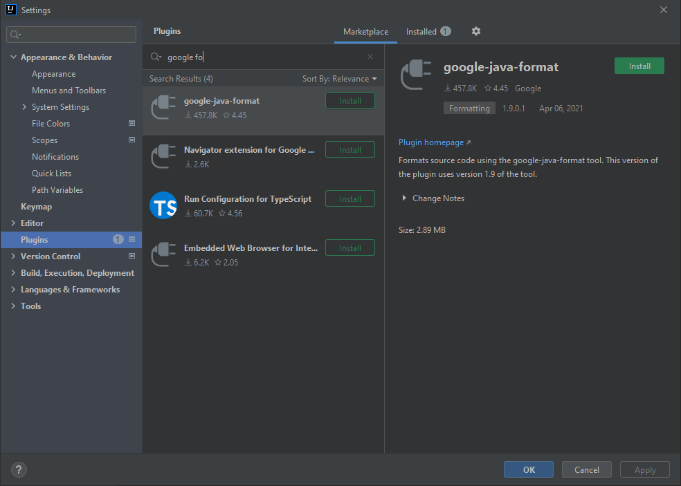
1. This requires a restart of the IDE. Select `Restart IDE`.
1. The plugin needs to be enabled. Open settings again and go to the settings for the plugin, `File -> Settings -> google java format Settings`. Click the box to enable the plugin and then save your settings with `Ok`.
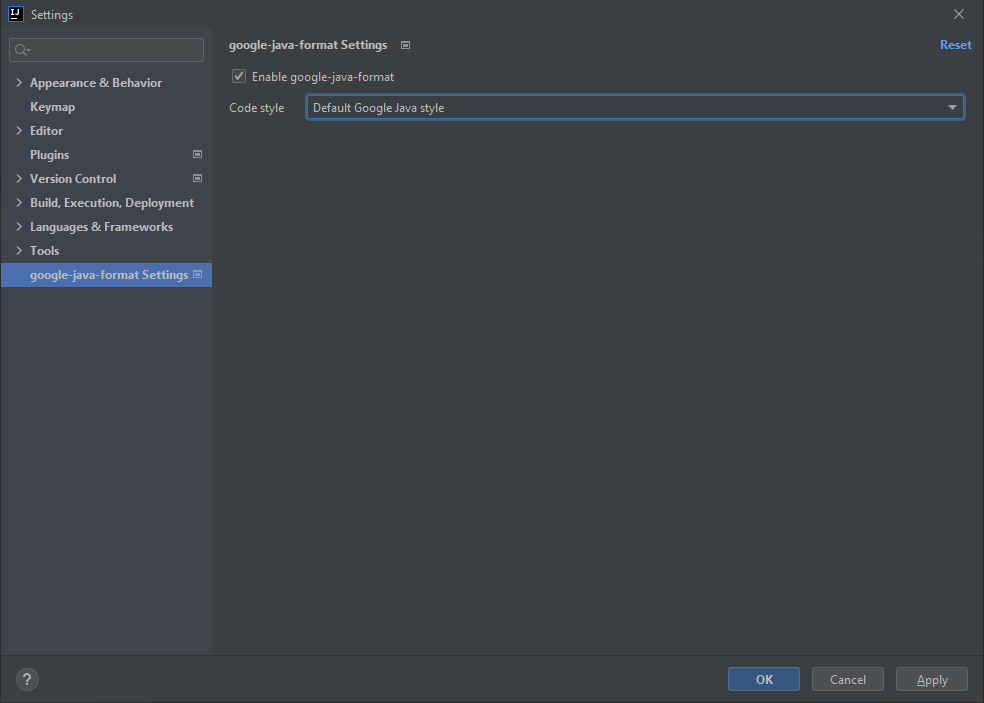

### Formatting
1. Select the `Code` dropdown, then `Reformat Code` or use the hotkey `ctrl+alt+L`.
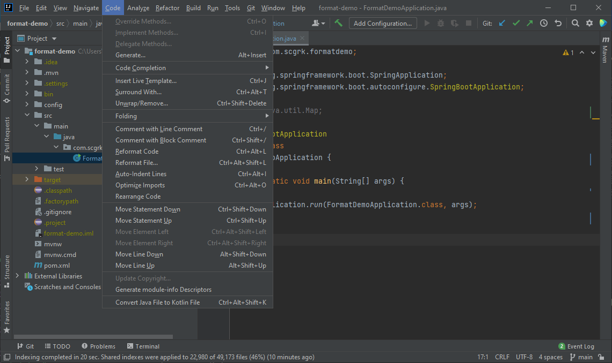
1. To optimize imports as well, select `Reformat File` and then enable the checkbox for this.
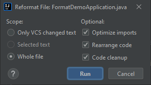
You can set this to work for the entire file or only what has been changed in version control. It is recommended you select for the entire file, but this can be a significant change across legacy code.
1. To enable auto-formatting on save, install the `save actions` plugin:
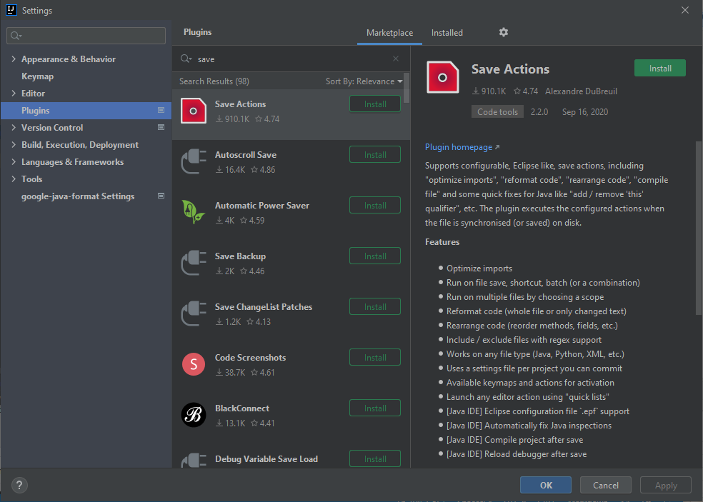
1. Configure the plugin by going to `File -> Plugins -> Other Settings -> Save Actions` and select the appropriate checkboxes:


AS A NOTE: By default, IntelliJ automatically saves changes as you code. If the editor loses focus, this plugin will be triggered and reformat your file according to your settings. If this is overly disruptive, the solution is to only allow the plugin to be triggered on the `ctrl+shift+S` hotkey.

## Enforcing standard with Checksytle Plugin
The Checkstyle plugin can be used to enforce formatting in CI pipelines and during local development by failing builds if they are not up to code.

### Setup
1. Add the plugin to the project `pom.xml` and include a `property` tag for the file location:
```xml
  <properties>
    <!-- other properties -->
    <styling.file.loc>${project.basedir}/config/google_checks.xml</styling.file.loc>
  </properties>

<!-- Dependencies and other requirements -->

  <build>
    <plugins>

      <plugin>
        <groupId>org.apache.maven.plugins</groupId>
        <artifactId>maven-checkstyle-plugin</artifactId>
        <version>3.1.1</version>
        <configuration>
          <configLocation>${styling.file.loc}</configLocation>
          <encoding>UTF-8</encoding>
          <consoleOutput>true</consoleOutput>
          <failsOnError>true</failsOnError>
          <maxAllowedViolations>0</maxAllowedViolations>
          <violationSeverity>ALL</violationSeverity>
          <failOnViolation>true</failOnViolation>
        </configuration>
        <executions>
          <execution>
            <id>validate</id>
            <phase>validate</phase>
            <goals>
              <goal>check</goal>
            </goals>
          </execution>
        </executions>
      </plugin>

      <!-- Other plugins -->
    </plugins>
  </build>
```

2. Include the [google_checks.xml file](https://raw.githubusercontent.com/checkstyle/checkstyle/master/src/main/resources/google_checks.xml) where indicated with the `style.file.loc` property. This file is also included at the base of this project.
3. Use the goal:
```sh
mvn checkstyle:check
```

The configuration above automatically runs Checkstyle during any `validate` phases (before build, install, etc).
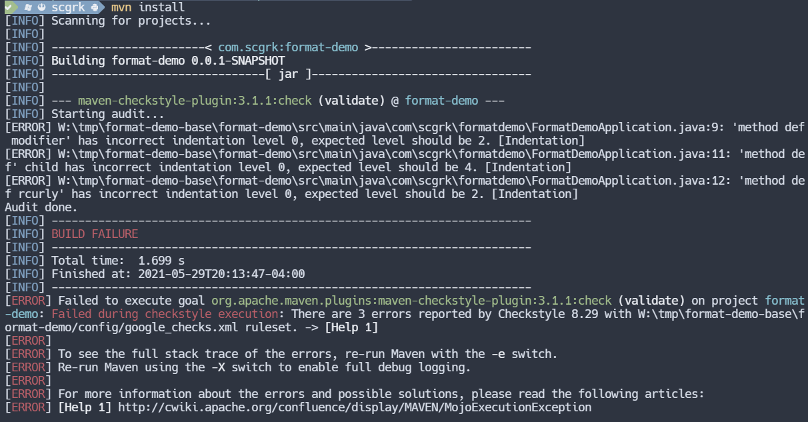

Formatting the files and rerunning the check will allow the build to pass:
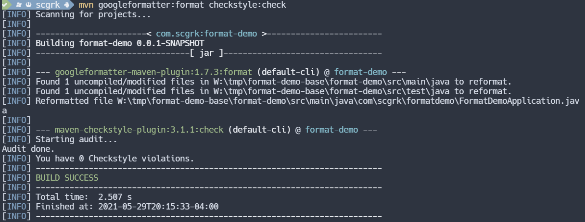


The plugin above can be configured as appropriate to be more lenient or not fail based on certain metrics. For more information about the plugin, see the [Maven Checkstyle Plugin documentation](https://maven.apache.org/plugins/maven-checkstyle-plugin/)
